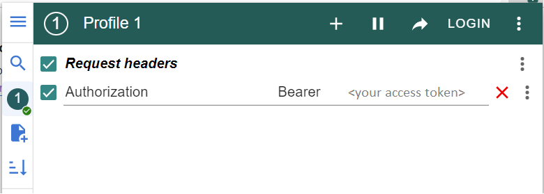

# Cinema API

API service for cinema management written on DRF

## Installing using Github

Install PostgreSQL and create db

```shell
git clone https://github.com/pavlejviki/cinema-api
cd cinema-api
python -m venv venv
source venv/bin/activate  # on macOS
venv\Scripts\activate  # on Windows 
pip install -r requirements.txt
set DB_HOST=<your db hostname>
set DB_NAME=<your db name>
set DB_USER=<your db username>
set DB_PASSWORD=<your db user password>
python manage.py migrate
python manage.py runserver
```
### Run with docker

Docker should be installed

```shell
docker-compose build
docker-compose up
```

Getting access
-
- create user via /api/user/register/
- get access token via /api/user/token/
- to simplify your authorization use an extension to modify headers [ModHeader](https://modheader.com/)

- your access token is valid for 5 min only, refresh it via /api/user/token/refresh/ to get a 1 day access


Features
-
- JWT authenticated
- Admin panel /admin/
- Documentation is located at /api/doc/swagger/
- Managing orders and tickets
- Creating movies with genres, actors and image
- Creating cinema halls
- Adding movie sessions
- Filtering movies and movie sessions
